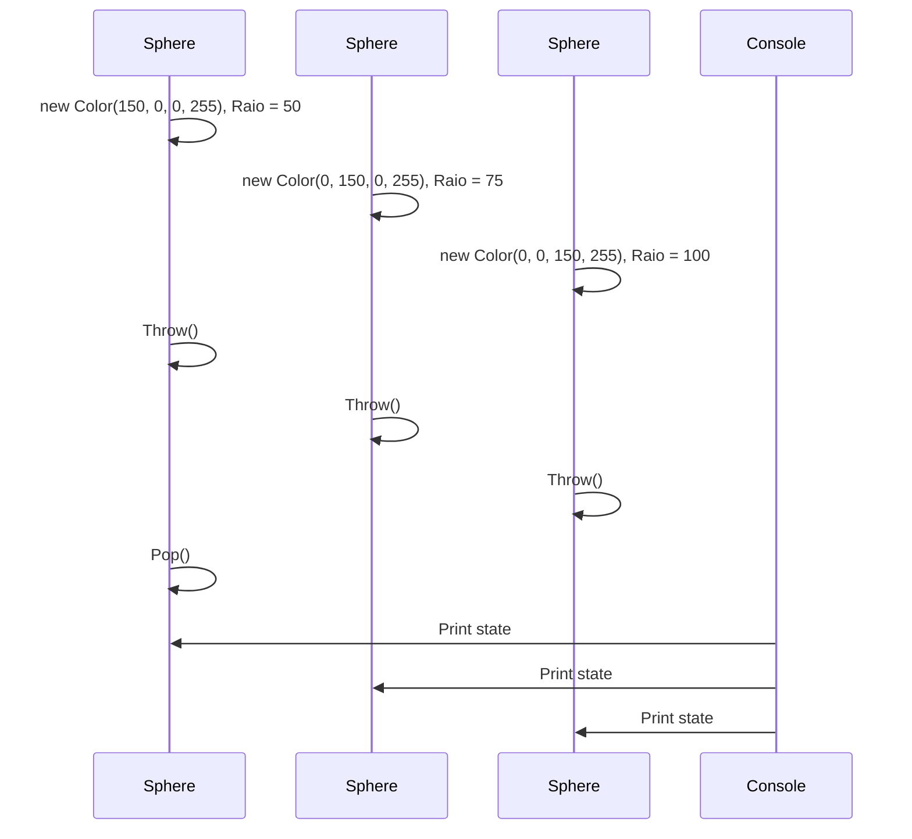

## UML

```mermaid
    sequenceDiagram
    participant Sphere1 as Sphere
    participant Sphere2 as Sphere
    participant Sphere3 as Sphere
    participant Console as Console

    Sphere1->>Sphere1: new Color(150, 0, 0, 255), Raio = 50
    Sphere2->>Sphere2: new Color(0, 150, 0, 255), Raio = 75
    Sphere3->>Sphere3: new Color(0, 0, 150, 255), Raio = 100

    Sphere1->>Sphere1: Throw()
    Sphere2->>Sphere2: Throw()
    Sphere3->>Sphere3: Throw()

    Sphere1->>Sphere1: Pop()

    Console->>Sphere1: Print state
    Console->>Sphere2: Print state
    Console->>Sphere3: Print state
```